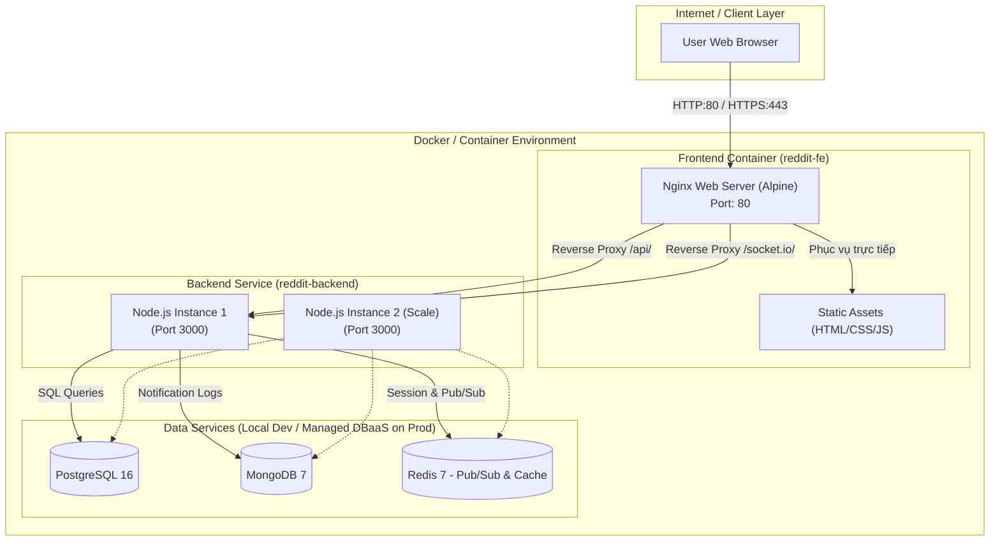
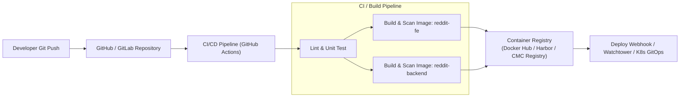

# 🚀 Kế Hoạch Container Hóa Hệ Thống Clouddit (reddit-backend & reddit-fe)

> **Mục tiêu:** Đóng gói toàn bộ ứng dụng **Clouddit** (Backend Node.js & Frontend Nginx/Static) thành các Docker Image chuẩn Production, tối ưu hóa kích thước (Lightweight), nâng cao tính bảo mật (Non-root, Security Hardening), và xây dựng môi trường điều phối linh hoạt (Docker Compose / CMC Cloud CCE / Kubernetes).

---

## 📑 Mục Lục
1. [Khảo Sát & Phân Tích Hiện Trạng](#1-khảo-sát--phân-tích-hiện-trạng)
2. [Kiến Trúc Container Hóa Mục Tiêu](#2-kiến-trúc-container-hóa-mục-tiêu)
3. [Chi Tiết Kế Hoạch Containerize Backend (`reddit-backend`)](#3-chi-tiết-kế-hoạch-containerize-backend-reddit-backend)
4. [Chi Tiết Kế Hoạch Containerize Frontend (`reddit-fe`)](#4-chi-tiết-kế-hoạch-containerize-frontend-reddit-fe)
5. [Kế Hoạch Điều Phối (Docker Compose Orchestration)](#5-kế-hoạch-điều-phối-docker-compose-orchestration)
6. [Quy Trình Tự Động Hóa CI/CD (Build & Push Registry)](#6-quy-trình-tự-động-hóa-cicd-build--push-registry)
7. [Lộ Trình Triển Khai Theo Từng Giai Đoạn (Phased Roadmap)](#7-lộ-trình-triển-khai-theo-từng-giai-đoạn-phased-roadmap)
8. [Tiêu Chí Đánh Giá Hoàn Thành (Definition of Done)](#8-tiêu-chí-đánh-giá-hoàn-thành-definition-of-done)

---

## 1. Khảo Sát & Phân Tích Hiện Trạng

| Hạng mục | **reddit-backend** | **reddit-fe** |
| :--- | :--- | :--- |
| **Công nghệ** | Node.js (v18+/v20+), Express 5, Socket.io | HTML5, CSS3, Vanilla JS (SPA-like Static) |
| **Thư viện đặc biệt** | `bcrypt` (C++ native addon), `pg`, `mongoose`, `redis` | Static assets, Nginx reverse proxy |
| **Phụ thuộc ngoại vi** | PostgreSQL, MongoDB, Redis | `reddit-backend` API & WebSocket |
| **Phương thức chạy cũ** | Chạy trực tiếp qua systemd service / `node server.js` | Nginx cài trực tiếp trên máy chủ host (`/var/www/reddit`) |
| **Thách thức khi đóng gói** | Build module `bcrypt` trên Alpine Linux; Cần xử lý biến môi trường (`.env`); Xử lý Graceful Shutdown | Dynamic proxy pass tới backend container; Cache static assets; Header WebSocket |

---

## 2. Kiến Trúc Container Hóa Mục Tiêu



---

## 3. Chi Tiết Kế Hoạch Containerize Backend (`reddit-backend`)

### 3.1. Chiến Lược Dockerfile (Multi-Stage Build)
* **Base Image:** `node:20-alpine` hoặc `node:20-bookworm-slim`.
* **Stage 1 (Builder):** Cài đặt công cụ compile native modules (`python3`, `make`, `g++`) để build `bcrypt` và chạy `npm ci --omit=dev`.
* **Stage 2 (Production Runner):** Chỉ copy `node_modules` và source code đã build sang image sạch, giảm dung lượng image từ ~800MB xuống còn **< 150MB**.
* **Bảo Mật:** Chạy dưới user không đặc quyền `USER node` (thay vì `root`).
* **Process Management & Signals:** Sử dụng `dumb-init` hoặc `node` trực tiếp để bắt các tín hiệu `SIGTERM`, `SIGINT` (Graceful Shutdown).

### 3.2. Cấu Trúc File Cần Tạo Cho `reddit-backend`
```text
reddit-backend/
├── Dockerfile
├── .dockerignore
├── .env.example
└── healthcheck.js (hoặc tận dụng GET /api/health)
```

### 3.3. File Template Dự Kiến

#### `.dockerignore`
```text
node_modules
npm-debug.log
.git
.gitignore
.env
.DS_Store
*.md
coverage
```

#### `Dockerfile` (Multi-stage Build & Non-root)
```dockerfile
# Stage 1: Build Dependencies
FROM node:20-alpine AS builder
WORKDIR /app
RUN apk add --no-cache python3 make g++ gcc
COPY package*.json ./
RUN npm ci --omit=dev

# Stage 2: Production Image
FROM node:20-alpine
WORKDIR /app
RUN apk add --no-cache dumb-init

ENV NODE_ENV=production
ENV PORT=3000

COPY --from=builder /app/node_modules ./node_modules
COPY package*.json ./
COPY . .

# Đổi quyền sang user node có sẵn của Alpine
USER node

EXPOSE 3000

# Healthcheck định kỳ
HEALTHCHECK --interval=30s --timeout=5s --start-period=10s --retries=3 \
  CMD wget --no-verbose --tries=1 --spider http://localhost:3000/api/health || exit 1

ENTRYPOINT ["/usr/bin/dumb-init", "--"]
CMD ["node", "server.js"]
```

---

## 4. Chi Tiết Kế Hoạch Containerize Frontend (`reddit-fe`)

### 4.1. Chiến Lược Dockerfile
* **Base Image:** `nginx:1.25-alpine` (Dung lượng siêu nhẹ ~25MB).
* **Nginx Configuration:**
  - Định tuyến các file tĩnh `.html`, `.css`, `.js`.
  - Cấu hình Gzip compression tăng tốc tải trang.
  - Proxy reverse `/api/` trỏ về service `http://backend:3000/`.
  - Proxy WebSocket `/socket.io/` với đầy đủ `Upgrade` và `Connection` headers.
  - Hỗ trợ biến môi trường bằng `envsubst` nếu cần thay đổi địa chỉ backend động.

### 4.2. Cấu Trúc File Cần Tạo Cho `reddit-fe`
```text
reddit-fe/
├── Dockerfile
├── .dockerignore
└── nginx.conf
```

### 4.3. File Template Dự Kiến

#### `.dockerignore`
```text
.git
.gitignore
.DS_Store
*.md
```

#### `nginx.conf`
```nginx
server {
    listen 80;
    server_name localhost;

    root /usr/share/nginx/html;
    index index.html;

    gzip on;
    gzip_types text/plain text/css application/javascript application/json image/svg+xml;

    client_max_body_size 10m;

    location / {
        try_files $uri $uri/ /index.html;
    }

    # Proxy API requests to Backend Container
    location /api/ {
        proxy_pass http://backend:3000;
        proxy_http_version 1.1;
        proxy_set_header Host $host;
        proxy_set_header X-Real-IP $remote_addr;
        proxy_set_header X-Forwarded-For $proxy_add_x_forwarded_for;
        proxy_set_header X-Forwarded-Proto $scheme;
        proxy_connect_timeout 5s;
        proxy_read_timeout 60s;
    }

    # Proxy WebSocket connections
    location /socket.io/ {
        proxy_pass http://backend:3000;
        proxy_http_version 1.1;
        proxy_set_header Upgrade $http_upgrade;
        proxy_set_header Connection "upgrade";
        proxy_set_header Host $host;
        proxy_set_header X-Real-IP $remote_addr;
        proxy_set_header X-Forwarded-For $proxy_add_x_forwarded_for;
        proxy_set_header X-Forwarded-Proto $scheme;
        proxy_read_timeout 3600s;
        proxy_send_timeout 3600s;
    }
}
```

#### `Dockerfile`
```dockerfile
FROM nginx:1.25-alpine

# Xóa cấu hình mặc định
RUN rm -rf /etc/nginx/conf.d/default.conf

# Copy cấu hình Nginx tối ưu cho dự án
COPY nginx.conf /etc/nginx/conf.d/default.conf

# Copy toàn bộ mã nguồn tĩnh vào thư mục web root của Nginx
COPY . /usr/share/nginx/html

EXPOSE 80

HEALTHCHECK --interval=30s --timeout=3s --start-period=5s --retries=3 \
  CMD wget --no-verbose --tries=1 --spider http://localhost/ || exit 1

CMD ["nginx", "-g", "daemon off;"]
```

---

## 5. Kế Hoạch Điều Phối (Docker Compose Orchestration)

Xây dựng 2 file Docker Compose phục vụ 2 mục đích riêng biệt:

### 5.1. `docker-compose.yml` (Local Development All-in-One)
Chạy toàn bộ hệ thống cục bộ chỉ với **1 câu lệnh duy nhất** (`docker compose up -d`):
* `frontend`: Chạy `reddit-fe` (Port 80 hoặc 8080).
* `backend`: Chạy `reddit-backend` (Port 3000).
* `postgres`: PostgreSQL 16 (Tự động chạy script `db-pg-init.js` hoặc `.sql`).
* `mongodb`: MongoDB 7.
* `redis`: Redis 7.

### 5.2. `docker-compose.prod.yml` (Production trên CMC Cloud / Server riêng)
* Sử dụng DBaaS có sẵn của CMC Cloud (PostgreSQL, Mongo, Redis trên cụm Managed Database).
* Chỉ khởi chạy cụm `backend` (scale nhiều replicas) và `frontend`.
* Gán các giới hạn tài nguyên (`deploy.resources.limits`: CPU/Memory) để tránh hiện tượng tràn RAM (OOM).
* Thiết lập chính sách tự khởi động lại `restart: always`.

---

## 6. Quy Trình Tự Động Hóa CI/CD (Build & Push Registry)



* **Image Tagging Convention:**
  - `reddit-backend:latest`
  - `reddit-backend:v4.0.0`
  - `reddit-backend:commit-<short-sha>`

---

## 7. Lộ Trình Triển Khai Theo Từng Giai Đoạn (Phased Roadmap)

| Giai đoạn | Nhiệm vụ chính | Kết quả đầu ra (Deliverables) | Thời gian ước lượng |
| :--- | :--- | :--- | :--- |
| **Giai đoạn 1: Chuẩn bị & Refactor mã nguồn** | • Bổ sung endpoint `/api/health` cho Backend<br>• Kiểm tra và chuẩn hóa cấu hình `.env.example`<br>• Xử lý biến cấu hình WebSocket/API trên Frontend | Code sẵn sàng cho Docker | 0.5 ngày |
| **Giai đoạn 2: Viết Dockerfile & Tối ưu Image** | • Viết `Dockerfile` & `.dockerignore` cho `reddit-backend`<br>• Viết `Dockerfile` & `nginx.conf` cho `reddit-fe`<br>• Test build local và benchmark kích thước image | Dockerfile hoàn chỉnh, Image < 150MB | 1 ngày |
| **Giai đoạn 3: Xây dựng Docker Compose Dev** | • Viết `docker-compose.yml` (Backend + Frontend + PG + Mongo + Redis)<br>• Tự động nạp schema dữ liệu mẫu vào PostgreSQL<br>• Test luồng tương tác Web, Đăng nhập, Tạo bài, WebSocket Realtime | Môi trường Dev chạy 100% bằng Docker | 1 ngày |
| **Giai đoạn 4: Bảo mật & Production Hardening** | • Chạy security scan image (Trivy / Docker Scout)<br>• Cấu hình non-root user, resource limits (CPU/RAM)<br>• Viết `docker-compose.prod.yml` kết nối CMC Managed DB | Bộ cấu hình chuẩn Production | 0.5 ngày |
| **Giai đoạn 5: Tự động hóa CI/CD & Tài liệu hóa** | • Tạo GitHub Actions workflow (`.github/workflows/docker-build.yml`)<br>• Hoàn thiện `README.md` hướng dẫn deploy chi tiết | CI/CD pipeline và tài liệu vận hành | 1 ngày |

---

## 8. Tiêu Chí Đánh Giá Hoàn Thành (Definition of Done)

- [ ] **Khởi động 1 lệnh:** Chạy `docker compose up -d` là toàn bộ Frontend, Backend, Database hoạt động đồng bộ không báo lỗi.
- [ ] **Image Size tối ưu:** Backend Image `< 200MB`, Frontend Image `< 35MB`.
- [ ] **Bảo mật:** Không chạy container bằng quyền `root`; Không hardcode secret/password trong Dockerfile.
- [ ] **Chức năng toàn vẹn:**
  - Đăng ký / Đăng nhập JWT hoạt động trơn tru.
  - CRUD bài viết & bình luận lưu vào PostgreSQL thành công.
  - Thông báo thời gian thực qua WebSocket/Socket.io hoạt động ổn định qua Nginx Proxy.
  - Redis cache & Pub/Sub đồng bộ thông suốt.
- [ ] **Healthcheck & Restart:** Container tự động khởi động lại khi crash và có cơ chế giám sát sức khỏe (Healthcheck) định kỳ.
