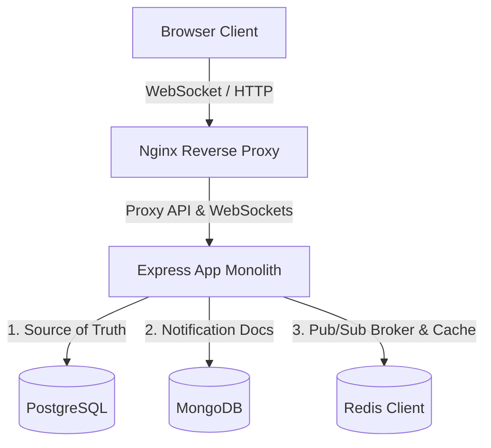
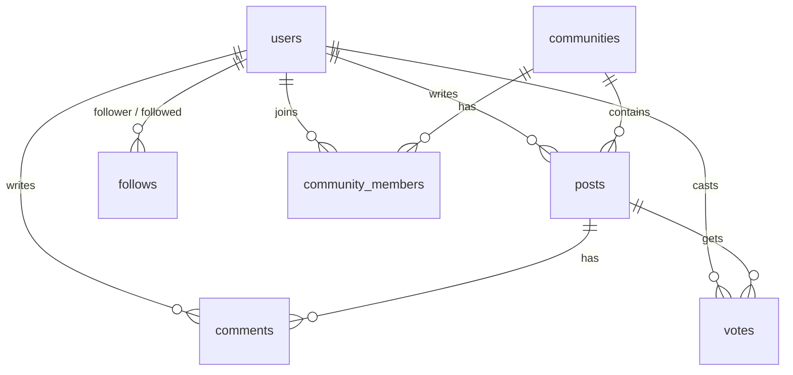

# Tài liệu kiến trúc 3 Database: PostgreSQL, MongoDB, Redis trong Clouddit

Hệ thống Clouddit sử dụng mô hình kết hợp đồng thời 3 loại cơ sở dữ liệu (**PostgreSQL**, **MongoDB**, và **Redis**) để tối ưu hóa hiệu năng, khả năng mở rộng (horizontal scaling) và phân chia trách nhiệm (Separation of Concerns) theo thiết kế monolith hiện đại.

---

## Tổng quan kiến trúc hệ thống



| Database | Phân loại | Vai trò chính | Tần suất đọc/ghi |
| :--- | :--- | :--- | :--- |
| **PostgreSQL** | Relational DB (SQL) | Nguồn sự thật (Source of Truth), lưu trữ thực thể nghiệp vụ cốt lõi | Đọc nhiều / Ghi trung bình |
| **MongoDB** | Document Store (NoSQL) | Lưu trữ lịch sử thông báo (Notifications), hỗ trợ truy vấn phân trang | Ghi nhiều (mọi tương tác) / Đọc theo đợt |
| **Redis** | In-Memory Key-Value | Message Broker (Pub/Sub) cho WebSocket & Caching số thông báo chưa đọc | Đọc/Ghi cực lớn (microsecond latency) |

---

## 1. PostgreSQL - Nguồn sự thật (Source of Truth)

### A. Nhiệm vụ
*   Lưu trữ toàn bộ các dữ liệu quan trọng có tính ràng buộc quan hệ chặt chẽ và yêu cầu tính toàn vẹn giao dịch cao (ACID).
*   Đóng vai trò định danh ID cho người dùng, bài viết, bình luận để làm khóa ngoại tham chiếu sang MongoDB và Redis.

### B. Cấu trúc lưu trữ (Schema)

PostgreSQL lưu trữ dữ liệu dưới dạng các bảng liên kết quan hệ chặt chẽ:



1.  **Bảng `users`**:
    *   `id` (SERIAL, PRIMARY KEY): Khóa chính, ID định danh người dùng.
    *   `username` (VARCHAR, UNIQUE): Tên tài khoản.
    *   `email` (VARCHAR, UNIQUE): Địa chỉ email.
    *   `password_hash` (VARCHAR): Mật khẩu đã được mã hóa bằng bcrypt.
    *   `created_at` (TIMESTAMP): Thời gian đăng ký.

2.  **Bảng `posts`**:
    *   `id` (SERIAL, PRIMARY KEY): ID bài viết.
    *   `user_id` (INT, FOREIGN KEY): Người tạo bài viết.
    *   `community_id` (INT, FOREIGN KEY, NULLABLE): Community chứa bài viết (nếu có).
    *   `title` (VARCHAR): Tiêu đề bài viết.
    *   `content` (TEXT): Nội dung bài viết.
    *   `image_data` (TEXT, NULLABLE): Ảnh đính kèm (base64).
    *   `created_at` (TIMESTAMP).

3.  **Bảng `comments`**:
    *   `id` (SERIAL, PRIMARY KEY): ID bình luận.
    *   `post_id` (INT, FOREIGN KEY): Bài viết được bình luận.
    *   `user_id` (INT, FOREIGN KEY): Người bình luận.
    *   `content` (TEXT): Nội dung bình luận.
    *   `created_at` (TIMESTAMP).

4.  **Bảng `votes`**:
    *   `user_id` (INT), `post_id` (INT) -> COMPOSITE PRIMARY KEY.
    *   `vote` (INT): Giá trị `1` (Upvote) hoặc `-1` (Downvote).

5.  **Bảng `communities`**:
    *   `id` (SERIAL, PRIMARY KEY): ID subreddit.
    *   `name` (VARCHAR, UNIQUE): Tên cộng đồng (r/name).
    *   `description` (TEXT): Mô tả cộng đồng.

6.  **Bảng `follows`**:
    *   `follower_id` (INT, FOREIGN KEY): Người bấm theo dõi.
    *   `followed_id` (INT, FOREIGN KEY): Người được theo dõi.
    *   Ràng buộc quan hệ: Người dùng không thể tự follow chính mình.

7.  **Bảng `community_members`**:
    *   `user_id` (INT, FOREIGN KEY): Thành viên join.
    *   `community_id` (INT, FOREIGN KEY): Cộng đồng tham gia.

---

## 2. MongoDB - Kho lưu trữ tài liệu Thông báo (Notification Store)

### A. Nhiệm vụ
*   Lưu trữ lịch sử tất cả thông báo của người dùng dưới dạng Document.
*   MongoDB được chọn cho phần thông báo vì:
    1.  **Traffic ghi cực lớn**: Mỗi hành động tương tác (comment, upvote, follow, bài đăng mới...) đều tạo ra 1 hoặc nhiều thông báo mới. MongoDB ghi bất đồng bộ (non-blocking write) cực tốt.
    2.  **Cấu trúc dữ liệu linh hoạt**: Nội dung thông báo biến đổi theo loại (ví dụ: thông báo upvote cần lưu số lượt upvote gộp, thông báo comment cần đoạn trích nội dung `contentSnippet`).
    3.  **Tính năng tự động dọn dẹp**: Tích hợp sẵn cơ chế xóa bản ghi hết hạn (TTL Index) không cần viết cron job xóa thủ công trong SQL.

### B. Cấu trúc lưu trữ (Mongoose Schema)
Dữ liệu lưu trữ trong collection `notifications` có cấu trúc JSON-like như sau:

```json
{
  "_id": "6a83dc5797e4a3d74ea895e9",
  "userId": 1,
  "type": "comment_reply",
  "sender": {
    "id": 2,
    "username": "bob"
  },
  "entityId": 101,
  "entityType": "post",
  "communityName": "general",
  "title": "u/bob commented on your post \"My first post\"",
  "contentSnippet": "This is an awesome post!",
  "isRead": false,
  "createdAt": "2026-08-18T04:15:19.000Z"
}
```

### C. Cơ chế tối ưu hóa Index
*   **Compound Index `{ userId: 1, createdAt: -1 }`**: Phục vụ việc phân trang (pagination) lấy danh sách thông báo mới nhất của người dùng một cách nhanh nhất.
*   **Compound Index `{ userId: 1, isRead: 1, createdAt: -1 }`**: Phục vụ việc lọc thông báo chưa đọc, đồng thời cho phép MongoDB chạy lệnh đếm số lượng chưa đọc (`countDocuments`) bằng cơ chế **Index-Only Scan (IXSCAN)** (tốc độ xử lý dưới 1ms, không cần quét ổ đĩa vật lý).
*   **TTL Index `{ createdAt: 1 } (expireAfterSeconds: 2592000)`**: MongoDB tự động xóa các thông báo cũ hơn 30 ngày trong background định kỳ, giữ cho collection không bị phình to vô hạn.

---

## 3. Redis - Bộ đệm hiệu năng & Trục truyền tin nhắn (Pub/Sub & Caching)

### A. Nhiệm vụ
*   **WebSocket Broker (Pub/Sub)**: Đồng bộ hóa tín hiệu đẩy thông báo real-time qua WebSocket giữa nhiều worker hoặc server chạy song song (ngăn lỗi mất real-time khi user đang kết nối WebSocket ở Worker A nhưng sự kiện tạo comment lại phát ra ở Worker B).
*   **Unread Count Cache**: Lưu trữ số lượng thông báo chưa đọc của user để tránh việc phải liên tục truy vấn vào MongoDB mỗi khi user chuyển trang hoặc tải lại giao diện.

### B. Cơ chế hoạt động của Redis Pub/Sub

Khi có sự kiện mới (Ví dụ: u/B comment vào bài viết của u/A):

```text
[Express Server Node 1] 
    └─> Lưu dữ liệu Postgres & MongoDB thành công
    └─> Gọi publishEvent() gửi tin nhắn lên Redis qua kênh 'notifications'
             │
             ▼
[Redis Pub/Sub Kênh 'notifications']
             │
   ┌─────────┴─────────┐
   ▼                   ▼
[Express Server Node 1]  [Express Server Node 2]
   │                       │
   │ (Nhận tin từ Redis)   │ (Nhận tin từ Redis)
   │                       │
   │ ─> Không thấy socket  │ ─> Thấy Socket của User A trong room 'user:A'
   │    của User A         │ ─> Thực hiện io.to('user:A').emit('notification')
   │    (bỏ qua)           │
                           ▼
                     [Trình duyệt User A] ──> Hiện Toast thông báo tức thì!
```

*   **Publisher**: Khi có thông báo mới, API gọi `publishEvent('notifications', { userId, notification })`.
*   **Subscriber**: Tất cả các server node khi khởi động đều chạy `subscribeToChannel('notifications', callback)`. Khi nhận tin, chúng kiểm tra xem user nhận thông báo có đang kết nối Socket tới chính node đó không. Nếu có, node đó sẽ đẩy dữ liệu ra WebSocket ngay lập tức.

### C. Cơ chế hoạt động của Redis Caching

Hệ thống quản lý key `unread_count:${userId}` với TTL 1 giờ (3600 giây):

1.  **Khi Client yêu cầu lấy số lượng chưa đọc (GET /unread-count)**:
    *   Kiểm tra trong Redis: `GET unread_count:${userId}`.
    *   **Cache Hit**: Nếu có, trả về giá trị ngay lập tức (không chạm vào MongoDB).
    *   **Cache Miss**: Nếu không có, truy vấn đếm từ MongoDB -> lưu giá trị vào Redis bằng `SETEX unread_count:${userId} 3600 <count>` -> trả về cho client.
2.  **Khi có thông báo mới được tạo thành công**:
    *   Hệ thống gọi lệnh `INCR unread_count:${userId}` của Redis. Nếu key đang tồn tại trong cache, bộ đếm tăng thêm `1` trực tiếp mà không cần đọc lại MongoDB.
3.  **Khi người dùng đánh dấu đã đọc (Mark as Read)**:
    *   **Đọc từng cái**: Xóa cache bằng `DEL unread_count:${userId}` (invalidate cache) để ép lượt gọi tiếp theo phải tính toán lại chính xác từ DB.
    *   **Đọc tất cả**: Ghi đè thẳng cache về 0 bằng `SETEX unread_count:${userId} 3600 0` vì ta biết chắc chắn số lượng lúc này bằng không.

---

## 4. Chi tiết cơ chế Redis Pub/Sub trong môi trường đa máy chủ (Multi-EC2 / PM2 Cluster)

### A. Vấn đề của mô hình Đa máy chủ nếu không dùng Pub/Sub
Giả sử bạn triển khai backend trên 2 máy chủ EC2 khác nhau: **EC2-A** và **EC2-B**, đứng sau một bộ cân bằng tải (Load Balancer):
1. **User A** đăng nhập, trình duyệt thiết lập kết nối WebSocket (Socket.io). Load Balancer định tuyến kết nối này tới máy chủ **EC2-A**. Danh sách socket hoạt động của User A lúc này chỉ được lưu trong RAM của **EC2-A**.
2. **User B** viết bình luận phản hồi User A, HTTP request gửi đến và được Load Balancer định tuyến tới máy chủ **EC2-B**.
3. **EC2-B** thực hiện lưu comment vào Postgres, lưu thông báo vào MongoDB. Sau đó nó gọi hàm `sendNotification(UserAId)`.
4. Vì **EC2-B** chỉ kiểm tra danh sách kết nối WebSocket trong RAM cục bộ của chính nó (không tìm thấy User A), sự kiện real-time bị hủy bỏ. **User A sẽ không thấy thông báo nhảy số màu đỏ** trừ khi họ bấm F5 lại trang để gọi API HTTP.

### B. Redis Pub/Sub giải quyết bài toán này như thế nào?
Để giải quyết bài toán đồng bộ WebSocket xuyên suốt các máy chủ, Redis đóng vai trò làm trung gian truyền tin (Message Broker):
1. Cả **EC2-A** và **EC2-B** khi khởi động đều thiết lập kết nối TCP tới một máy chủ Redis trung tâm và thực thi lệnh `SUBSCRIBE notifications`.
2. Khi **EC2-B** xử lý hành động bình luận của User B, thay vì gửi Socket.io cục bộ, nó gọi `PUBLISH notifications <data>` gửi một chuỗi JSON gồm `{ userId: A, notification }` lên Redis.
3. Redis Server nhận gói tin, lập tức nhân bản và đẩy ngược lại qua các đường kết nối TCP đang mở tới **tất cả** các client đang subscribe (ở đây là cả **EC2-A** và **EC2-B**).
4. **EC2-A** nhận được tin từ Redis, kiểm tra bộ nhớ RAM cục bộ thấy đang giữ kết nối Socket của User A -> Thực hiện `emit('notification')` đẩy dữ liệu trực tiếp về trình duyệt của User A.
5. **EC2-B** cũng nhận được tin từ Redis, kiểm tra RAM cục bộ không có kết nối nào của User A -> Bỏ qua tin nhắn một cách an toàn.

### C. Cơ chế đảm bảo tính kết nối và phân phối tin nhắn giữa các máy chủ (EC2)
*   **Kết nối TCP bền vững (Persistent Connection)**: Client Redis trên Node.js duy trì kết nối TCP (Keep-Alive) liên tục tới Redis Server thông qua cổng `6379`. Miễn là cấu hình Security Group trên AWS của máy chủ chứa Redis mở cổng 6379 cho phép các máy chủ EC2 kết nối tới, việc liên lạc được đảm bảo.
*   **Cơ chế Auto-Reconnect tự động**: File [`redis.js`](file:///Users/caolegiaphu/Documents/cmc/reddit-project/reddit-backend/redis.js) đã được thiết kế sẵn hàm đệ quy kết nối lại sau mỗi 5 giây (`setTimeout(connectRedis, 5000)`) nếu đường truyền mạng gặp trục trặc.
*   **Xử lý phi trạng thái (Stateless Pub/Sub)**: Cơ chế Pub/Sub của Redis hoạt động theo mô hình *Fire and Forget* (gửi và quên), không lưu trữ lại dữ liệu tin nhắn cũ vào đĩa cứng. Điều này giúp Redis phân phối tin nhắn với độ trễ cực thấp (microsecond) mà không chiếm dụng dung lượng RAM của Redis Server, cực kỳ phù hợp cho các tương tác thời gian thực tần suất cao.

