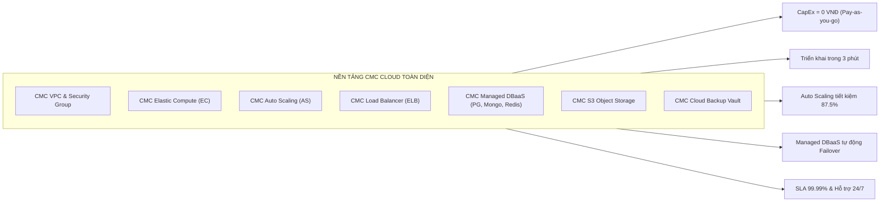

# So Sánh & Đánh Giá: Tự Dựng Server (On-Premise) vs. Dịch Vụ Hạ Tầng CMC Cloud

Tài liệu này phân tích chi tiết các khó khăn, thách thức thực tế mà doanh nghiệp phải đối mặt khi **tự dựng và tự vận hành hệ thống máy chủ vật lý (On-Premise / Self-hosted)** so với việc chuyển dịch sang **nền tảng điện toán đám mây CMC Cloud (CMC Cloud HCM1)**, được đúc rút từ quá trình thiết kế, triển khai và đo lường chi phí thực tế của dự án ứng dụng mạng xã hội **Clouddit**.

---

## 1. Tổng Quan Kiến Trúc Đối Sánh

```mermaid
graph TD
    subgraph ON_PREMISE["TỰ DỰNG SERVER (ON-PREMISE / CO-LOCATION)"]
        A1["Chi Phí Đầu Tư Ban Đầu (CapEx Cực Lớn)"] --> A2["Tự Mua Server, Switch, Firewall Vật Lý"]
        A2 --> A3["Tự Cài Đặt Hệ Thống, Cấu Hình Mạng, Kéo Cáp"]
        A3 --> A4["Gánh Nặng Vận Hành 24/7 & Rủi Ro Hỏng Phần Cứng"]
        A4 --> A5["Không Thể Co Giãn Khi Tăng Tải Đột Biến"]
    end

    subgraph CMC_CLOUD["DỊCH VỤ CMC CLOUD (MANAGED CLOUD HCM1)"]
        B1["Không Cần Vốn Ban Đầu (CapEx = 0 VNĐ)"] --> B2["Khởi Tạo VM, DBaaS, VPC Chỉ Trong Vài Phút"]
        B2 --> B3["Phân Tầng Mạng Cô Lập, Tích Hợp Sẵn Load Balancer & Firewall"]
        B3 --> B4["Auto Scaling Linh Hoạt Theo Tải Thực Tế (Pay-as-you-go)"]
        B4 --> B5["CMC Vận Hành 24/7, SLA 99.99%, Backup Tự Động Toàn Diện"]
    end
```

---

## 2. Những Khó Khăn & Thách Thức Khi Tự Dựng Server Vật Lý

### 2.1. Vốn đầu tư ban đầu (CapEx) khổng lồ & Rủi ro khấu hao
- **Chi phí thiết bị ban đầu**: Để dựng được một hệ thống chuẩn production tương đương kiến trúc Clouddit (gồm 2 Nginx Web, cụm 2 Backend Node.js, 3 Database riêng biệt PostgreSQL, MongoDB, Redis, thiết bị Firewall cứng, Switch Layer 3, Router), doanh nghiệp phải bỏ ra từ **300.000.000 – 600.000.000 VNĐ** ngay từ ngày đầu tiên.
- **Chi phí phòng máy / Thuê chỗ đặt (Co-location)**: Phải trang bị tủ Rack, nguồn điện kép dự phòng (UPS + Máy phát điện diesel), điều hòa chuẩn phòng server (chạy 24/7/365), hệ thống PCCC khí FM-200. Nếu thuê chỗ đặt ở Datacenter, chi phí thuê rack và đường truyền vẫn tốn hàng chục triệu đồng mỗi tháng cố định.
- **Rủi ro khấu hao & lỗi thời**: Vòng đời phần cứng máy chủ chỉ từ 3 - 5 năm. Sau thời gian này, thiết bị xuống cấp, hết bảo hành hãng, chi phí sửa chữa thay thế linh kiện tăng vọt.

### 2.2. Thời gian triển khai (Time to Market) kéo dài
- Khi cần máy chủ mới: Phải làm thủ tục phê duyệt ngân sách $\rightarrow$ Chờ nhập hàng (Lead time từ 4 – 8 tuần đối với server Dell/HPE/Supermicro chính hãng) $\rightarrow$ Lắp rack, kéo cáp, cài OS, setup network.
- Sự chậm trễ này làm mất đi cơ hội kinh doanh khi sản phẩm cần Go-Live gấp để chiếm lĩnh thị trường.

### 2.3. Khả năng mở rộng kém linh hoạt (Scalability Bottleneck)
- **Tình trạng "Đầu tư dư thừa" hoặc "Sập hệ thống"**:
  - Khi có chiến dịch Marketing hoặc khung giờ cao điểm (Peak Traffic): Hệ thống quá tải, CPU/RAM đạt 100%, sập kết nối nhưng không thể kịp mua thêm server cắm vào.
  - Khi vào khung giờ thấp tải (ban đêm): Hàng chục server cấu hình khủng vẫn chạy không tải, tiêu thụ điện năng và khấu hao phần cứng lãng phí.
- **Không có tính năng Auto Scaling tự động**: Không thể tự động bật thêm máy chủ trong 2 phút khi traffic tăng và tự tắt đi khi hết tải như Cloud.

### 2.4. Gánh nặng nhân sự vận hành & Bảo trì phần cứng (OpEx Nhân Sự)
- Doanh nghiệp phải duy trì đội ngũ kỹ sư chuyên trách: Kỹ sư phần cứng, Kỹ sư mạng (NetOps), Quản trị viên hệ thống (SysAdmin) và Quản trị viên cơ sở dữ liệu (DBA) túc trực xoay ca 24/7/365.
- Chi phí lương thưởng cho đội ngũ này thường chiếm từ **60.000.000 – 120.000.000 VNĐ/tháng**, cao hơn gấp nhiều lần chi phí thuê hạ tầng Cloud.
- Khi ổ cứng bị bad sector, thanh RAM lỗi hoặc nguồn máy chủ bị chập, kỹ sư phải có mặt trực tiếp tại phòng máy để tháo lắp thay thế.

### 2.5. Khó khăn trong quản trị cơ sở dữ liệu đa dạng (Multi-Database Management)
- Hệ thống Clouddit sử dụng đồng thời 3 cơ sở dữ liệu: **PostgreSQL** (ACID cốt lõi), **MongoDB** (Log thông báo linh hoạt) và **Redis** (Cache & Pub/Sub).
- Khi tự dựng:
  - Phải tự thiết lập Master-Slave Replication để dự phòng sự cố.
  - Phải tự viết script failover khi node chính bị sập (Split-brain risk).
  - Phải tự cấu hình tuning kernel Linux, I/O scheduler, swap và bảo mật cổng.
  - Tự chịu trách nhiệm cập nhật các bản vá bảo mật (Security Patches) định kỳ, nếu cấu hình sơ hở sẽ bị hacker quét cổng ransomware tống tiền.

### 2.6. Khó khăn về Mạng, IP Public & Chống tấn công DDoS
- Để có nhiều IP tĩnh (Static Public IP) mở dịch vụ ra Internet, doanh nghiệp phải ký hợp đồng thuê dải IP đắt đỏ từ ISP và đăng ký thủ tục phức tạp.
- Khi bị tấn công mạng (SYN Flood, UDP Flood, DDoS tầng ứng dụng L7), đường truyền cáp quang của văn phòng hoặc tủ rack thông thường sẽ bị nghẽn hoàn toàn, kéo sập toàn bộ các dịch vụ khác của doanh nghiệp.

### 2.7. Rủi ro Sao lưu và Khôi phục sau thảm họa (Backup & Disaster Recovery)
- Doanh nghiệp phải tự mua thêm hệ thống lưu trữ SAN/NAS hoặc băng từ (Tape) riêng.
- Tự viết và quản lý các script `cronjob` snapshot, rsync dữ liệu ra nơi khác.
- Rất hiếm khi doanh nghiệp tự kiểm thử khôi phục (Restore Drill) do tốn tài nguyên. Đến khi xảy ra sự cố thật (cháy nổ, mã độc mã hóa dữ liệu), bản sao lưu mới phát hiện bị lỗi không phục hồi được, dẫn đến mất trắng dữ liệu kinh doanh.

---

## 3. Sự Khác Biệt Vượt Trội Khi Sử Dụng Dịch Vụ CMC Cloud

CMC Cloud (cụm Data Center HCM1 / HN) cung cấp giải pháp hạ tầng toàn diện chuẩn Tier 3, giải quyết triệt để toàn bộ các khó khăn trên:

### 3.1. Chuyển dịch toàn bộ từ CapEx sang OpEx linh hoạt
- **Chi phí đầu tư ban đầu = 0 VNĐ**: Doanh nghiệp không cần vay vốn hoặc bỏ ra hàng trăm triệu đồng mua máy chủ.
- **Thanh toán theo mức tiêu dùng thực tế (Pay-as-you-go)**: Trả tiền theo tháng hoặc theo giờ sử dụng, dễ dàng dự toán ngân sách và quản lý dòng tiền kinh doanh.

### 3.2. Khởi tạo và bàn giao hạ tầng chỉ trong vài phút (Instant Provisioning)
- Cần một cụm máy chủ mới 8 vCPUs – 8GB RAM? Chỉ mất **2 - 3 phút** trên Portal CMC Cloud hoặc qua API/Terraform.
- Cần mở rộng thêm ổ cứng dung lượng cao (HighIO)? Tăng dung lượng đĩa online chỉ bằng 1 thanh trượt mà không cần tắt máy chủ (No Downtime).

### 3.3. Tối ưu chi phí vượt trội nhờ Auto Scaling (Minh chứng từ dự án Clouddit)
- Kiến trúc Clouddit triển khai trên CMC Cloud sử dụng gói máy chủ **`c6.2xlarge.1` (8 vCPUs | 8 GB RAM)** với đơn giá chỉ **`3.212 VNĐ / giờ`**.
- Thay vì phải thuê cố định máy chủ phụ chạy 24/7 gây lãng phí $3.708.000\text{ đ/tháng}$, hệ thống Auto Scaling chỉ kích hoạt thêm 2 máy chủ vào khung giờ cao điểm (**10% thời gian trong tháng $\approx$ 72 giờ**):
  $$\text{Chi phí mở rộng thêm 2 ECs} = 2 \times 72\text{ giờ} \times 3.212\text{ đ/giờ} = \mathbf{462.528\text{ VNĐ / tháng}}$$
- **Tiết kiệm đến 87.5% chi phí mở rộng** (tiết kiệm hơn **3.24 Triệu VNĐ/tháng**), giúp doanh nghiệp luôn đảm bảo năng lực chịu tải tối đa với mức chi phí tăng thêm chưa tới 500 nghìn đồng.

### 3.4. Dịch vụ Cơ sở dữ liệu Quản trị (Managed DBaaS) hoàn toàn tự động
- Thay vì phải tự cài đặt và bảo trì:
  - **PostgreSQL Managed**: Tích hợp sẵn chuẩn kết nối, tối ưu hóa I/O và hỗ trợ Point-in-Time Recovery (PITR) chính xác tới từng giây.
  - **MongoDB Managed**: Cung cấp sẵn cơ chế cluster, tự động mở rộng theo tải ghi nhật ký thông báo lớn.
  - **Redis Managed**: Đảm bảo tốc độ truy xuất RAM $<1\text{ms}$ cho bộ nhớ đệm và kết nối Pub/Sub Socket.io ổn định.
- CMC Cloud tự động xử lý việc vá lỗi bảo mật, backup định kỳ hàng ngày lúc 03:00 AM và sẵn sàng failover khi có sự cố.

### 3.5. Mạng riêng ảo (VPC) & An ninh phòng thủ chiều sâu (Defense-in-Depth)
- **Kiến trúc phân tầng cô lập**: CMC Cloud cho phép tạo mạng riêng ảo `cmc-prod-hcm1-vpc` chia tách thành 3 vùng mạng độc lập:
  - *Public DMZ Subnet*: Đặt Nginx và Public ELB mở cổng 80/443 ra ngoài.
  - *Private Subnet*: Đặt cụm Node.js API hoàn toàn không có IP public.
  - *Isolated DB Subnet*: Đặt cơ sở dữ liệu tách biệt vật lý khỏi Internet, kết hợp tường lửa **pfSense Firewall Appliance** kiểm duyệt gắt gao từng gói tin.
- Toàn bộ kết nối quản trị bắt buộc đi qua **Bastion Jumpbox** có xác thực khóa SSH và VPN nội bộ.

### 3.6. Hệ thống Lưu trữ & Sao lưu chuẩn doanh nghiệp (S3 & Cloud Backup)
- **CMC S3 Standard Storage**: Dung lượng 1,000 GB (1 TB) với chi phí chỉ **1.000.000 VNĐ/tháng** (1.000 đ/GB), hỗ trợ lưu trữ media, avatar, bài đăng của người dùng với độ bền dữ liệu 99.999999999% (11 số 9).
- **CMC Cloud Backup Vault (`vault-vs26`)**: Tự động chụp snapshot toàn bộ hệ điều hành máy chủ và DB định kỳ hàng ngày, lưu trữ an toàn cách ly, cho phép khôi phục nguyên trạng hệ thống chỉ sau chưa đầy **30 phút (RTO $<30$ phút)**.

---

## 4. Bảng So Sánh Toàn Diện (On-Premise vs. CMC Cloud)

| Tiêu Chí Đánh Giá | Tự Dựng Server (On-Premise) | Dịch Vụ CMC Cloud (HCM1) | Lợi Thế CMC Cloud |
|---|---|---|---|
| **Vốn đầu tư ban đầu (CapEx)** | **Rất lớn** (300M – 600M VNĐ cho phần cứng, mạng, tủ rack) | **0 VNĐ** (Không chi phí thiết lập ban đầu) | Tiết kiệm 100% dòng vốn đầu tư ban đầu |
| **Mô hình chi phí (OpEx)** | Cố định cao (Điện, làm mát, băng thông, linh kiện thay thế) | **Linh hoạt** (Chỉ trả đúng tài nguyên thực tế sử dụng) | Tối ưu hóa dòng tiền doanh nghiệp |
| **Thời gian triển khai (Time to Market)** | Mất từ **4 đến 8 tuần** (Đặt hàng, lắp ráp, cấu hình) | Mất từ **3 đến 5 phút** (Portal/API tự động hóa) | Nhanh hơn gấp hàng trăm lần |
| **Khả năng co giãn (Scalability)** | Kém linh hoạt (Phải mua thêm máy chủ vật lý mới scale được) | **Tự động mở rộng (Auto Scaling)** theo CPU/RAM thời gian thực | Co giãn tức thì theo tải đỉnh |
| **Chi phí giờ cao điểm (Peak Hours)** | Phải mua sẵn server cấu hình khủng chạy 24/7 tốn kém | Dùng AS chạy 10% thời gian chỉ tốn thêm **~462k/tháng** | Tiết kiệm **87.5%** ngân sách scale |
| **Bảo trì phần cứng (Hardware Maintenance)** | Tự chịu 100% rủi ro hỏng ổ cứng, RAM, chập nguồn | CMC Cloud chịu trách nhiệm thay thế và nâng cấp ngầm | Doanh nghiệp không lo rủi ro hỏng linh kiện |
| **Đội ngũ nhân sự (IT Staff)** | Cần 3 - 5 nhân sự (NetOps, SysAdmin, DBA, Hardware) túc trực 24/7 | Chỉ cần 1 kỹ sư DevOps/Cloud quản trị cấu hình | Tiết kiệm 60M – 100M VNĐ/tháng chi phí nhân sự |
| **Quản trị Database (DBaaS)** | Tự cài đặt, tự cấu hình Master-Slave, tự giải quyết failover | **Managed DBaaS** (PostgreSQL, MongoDB, Redis sẵn sàng) | Giảm thiểu 95% thời gian quản trị DB |
| **Sao lưu & Khôi phục (Backup & DR)** | Tự mua tủ đĩa SAN/NAS, viết script cronjob, rủi ro hỏng đĩa | **Cloud Backup Vault** tự động daily snapshot, PITR từng giây | Đảm bảo RPO $<5$ phút, RTO $<30$ phút |
| **Bảo mật & Chứng chỉ (Security)** | Tự bảo vệ, khó đạt chuẩn quốc tế nếu không đầu tư lớn | Đạt chuẩn **ISO 27001, PCI-DSS, Tier 3 Datacenter** | Tuân thủ tiêu chuẩn an ninh thông tin cao nhất |
| **Hỗ trợ kỹ thuật (Support)** | Tự tìm kiếm giải pháp hoặc chờ hãng bảo hành phản hồi | Đội ngũ kỹ sư CMC Cloud hỗ trợ **24/7 tiếng Việt** qua ticket/hotline | Xử lý sự cố ngay lập tức |

---

## 5. Vì Sao Chọn CMC Cloud Thay Vì Các Nền Tảng Cloud Khác Tại Việt Nam?

Tại thị trường Việt Nam, bên cạnh CMC Cloud còn có các nhà cung cấp nội địa khác như **Viettel Cloud, VNPT Cloud, FPT Smart Cloud, VNG Cloud, Bizfly Cloud**. Tuy nhiên, CMC Cloud sở hữu những lợi thế cạnh tranh mang tính cốt lõi và chuyên biệt mà các nền tảng khác khó thay thế được:

### 5.1. Hạ tầng Data Center Tân Thuận đẳng cấp quốc tế (Uptime Tier III kép & Chuẩn TVRA)
- **Data Center Tân Thuận (TP.HCM)** của CMC Telecom là một trong những DC hiện đại nhất Đông Nam Á:
  - Đạt chứng chỉ **Tier III kép về cả Thiết kế (TCDD) và Xây dựng thực tế (TCCF)** do Uptime Institute (Mỹ) cấp.
  - Đạt chứng chỉ **TVRA (Threat, Vulnerability and Risk Assessment)** - tiêu chuẩn an ninh và phòng chống rủi ro khắt khe nhất của Ngân hàng Trung ương Singapore (MAS), chuyên biệt cho khối Tài chính - Ngân hàng quốc tế.
  - Khả năng cấp nguồn lên tới **10 - 20 kW/rack**, sẵn sàng cho các cụm máy chủ mật độ cao (High-Density Computing & AI).

### 5.2. Vị thế Nhà Mạng Trung Lập (Carrier-Neutral) & Tuyến Cáp Quang A-GRID Độc Quyền
- **Tính trung lập (Carrier-Neutral)**: Không như Viettel hay VNPT (vốn ưu tiên lưu lượng mạng của chính mình), CMC Telecom là Telco trung lập kết nối bình đẳng với tất cả các ISP trong nước (VNPT, Viettel, FPT, Mobifone) với độ trễ nội hạt cực thấp ($< 2 - 5\text{ms}$).
- **Tuyến cáp đất liền xuyên Đông Nam Á (A-GRID)**: CMC là đơn vị duy nhất tại VN sở hữu tuyến cáp quang trên đất liền kết nối trực tiếp qua Campuchia, Thái Lan, Malaysia, Singapore.
  - **Miễn nhiễm với sự cố đứt cáp biển**: Khi các tuyến cáp quang biển (AAG, APG, IA, AAE-1) gặp sự cố đứt cáp thường niên, lưu lượng của khách hàng CMC Cloud vẫn lưu thoát ổn định đi quốc tế qua tuyến đất liền A-GRID mà không bị nghẽn mạng.

### 5.3. Tiên phong giải pháp Multi-Cloud & Kênh truyền riêng Direct Connect tới AWS / GCP / Azure
- CMC Telecom là đối tác cấp cao nhất tại Việt Nam của các Big Tech toàn cầu: **AWS Premier Tier Services Partner, Google Cloud Premier Partner, Microsoft Solutions Partner**.
- **CMC Cloud Interconnect / Direct Connect**: Doanh nghiệp có thể thiết lập đường truyền riêng vật lý (Layer 2/3 Private Link) kết nối trực tiếp hạ tầng CMC Cloud với AWS Singapore, Google Cloud hoặc Azure với băng thông từ 1Gbps đến 10Gbps và độ trễ $< 25\text{ms}$.
  - Cho phép doanh nghiệp vận hành mô hình **Hybrid Cloud hoàn hảo**: Lưu trữ dữ liệu người dùng tại CMC Cloud HCM1 để tuân thủ 100% **Luật An ninh mạng & Nghị định 13/2023/NĐ-CP**, đồng thời tận dụng AI/ML hoặc Big Data trên AWS/GCP mà không đi qua Internet công cộng.

### 5.4. Công nghệ phần cứng 100% Pure NVMe All-Flash & Chip Intel Enterprise Thế Hệ Mới
- Nhiều nhà cung cấp Cloud nội địa giá rẻ vẫn sử dụng hạ tầng lai (Hybrid SAS/SATA SSD cũ) dẫn đến tình trạng suy giảm IOPS và biến động I/O vào giờ cao điểm.
- CMC Cloud trang bị **100% ổ cứng NVMe Enterprise All-Flash** kết hợp công nghệ lưu trữ phân tán Ceph/SAN tốc độ cao:
  - Tốc độ đọc/ghi ngẫu nhiên đạt hàng trăm nghìn IOPS, độ trễ truy xuất $< 1\text{ms}$.
  - Đặc biệt tối ưu cho các hệ thống tải cao chạy đa cơ sở dữ liệu như PostgreSQL, MongoDB và Redis trong dự án Clouddit.

### 5.5. Hệ sinh thái Managed PaaS hoàn thiện & Hỗ trợ tích hợp Virtual Appliance
- Nhiều đơn vị trong nước chỉ bán máy chủ ảo (IaaS) thô dạng VPS, buộc khách hàng phải tự tay cài đặt và bảo trì mọi thứ.
- CMC Cloud cung cấp danh mục dịch vụ hoàn chỉnh:
  - **Managed DBaaS**: PostgreSQL, MongoDB, Redis tích hợp sẵn PITR, Auto-failover và Dashboard theo dõi hiệu năng.
  - **Auto Scaling Group**: Tích hợp với Elastic Load Balancer (ELB) tự động scale ngang theo ngưỡng tải thực tế.
  - **Virtual Appliance Ready**: Hỗ trợ triển khai trực tiếp các giải pháp tường lửa chuyên nghiệp hàng đầu như **pfSense, Fortigate-VM, Sophos** trên cùng một VPC mạng riêng mà không bị giới hạn kiến trúc.

### 5.6. Bảng So Sánh CMC Cloud vs. Các Nhóm Cloud Khác Tại Việt Nam

| Tiêu Chí So Sánh | CMC Cloud (HCM1 / HN) | Cloud Nhóm Telco (Viettel / VNPT) | Cloud Nhóm Internet (VNG / Bizfly) | Big Tech Quốc Tế (AWS / Azure / GCP) |
|---|---|---|---|---|
| **Độ trễ người dùng VN** | **Cực thấp (< 5ms)** | Cực thấp (< 5ms) | Thấp (< 10ms) | Trung bình (25 - 60ms do DC ở Singapore) |
| **Tính trung lập mạng (Carrier-Neutral)** | **Rất cao** (Bình đẳng định tuyến tới mọi ISP) | Trung bình (Ưu tiên mạng nội bộ) | Phụ thuộc đường truyền thuê ngoài | Kết nối qua ISP công cộng / Internet quốc tế |
| **Dự phòng đứt cáp biển** | **Tuyến cáp đất liền A-GRID độc quyền** | Phụ thuộc cáp biển & đất liền | Phụ thuộc nhà mạng viễn thông | Phụ thuộc cáp biển quốc tế (rủi ro nghẽn) |
| **Multi-Cloud Direct Connect** | **Sẵn sàng** (AWS Premier / Google Premier) | Hạn chế hoặc chi phí cao | Không hỗ trợ trực tiếp | Có Direct Connect nhưng chi phí port rất cao |
| **Chất lượng phần cứng** | **100% NVMe All-Flash & Chip mới** | Đa dạng phân khúc (cả SAS/SATA) | Tùy cụm hạ tầng | Rất cao |
| **Managed DBaaS & Appliance** | **Đầy đủ** (PG, Mongo, Redis, pfSense) | Đang phát triển / Chủ yếu IaaS | Tốt ở một số dịch vụ Web | Rất phong phú nhưng cấu hình phức tạp |
| **Chi phí Băng thông (Egress)** | **Miễn phí / Băng thông phẳng cố định** | Miễn phí hoặc cước phẳng | Miễn phí hoặc tính gói | **Rất đắt** ($0.09/GB, dễ gây sốc hóa đơn) |
| **Hỗ trợ kỹ thuật bản địa** | **24/7 Tiếng Việt** (Hotline/Ticket/Nhóm riêng) | 24/7 (Quy trình doanh nghiệp nhà nước) | Ticket / Giờ hành chính | Chat tiếng Anh, phí Support Plan đắt ($100+/tháng) |
| **Tuân thủ pháp lý VN (Nghị định 13)** | **100% Tuyệt Đối** (Hóa đơn VAT, DC tại VN) | 100% Tuyệt Đối | 100% Tuyệt Đối | Phức tạp trong thanh toán & biên giới dữ liệu |

---

## 6. Bảng Tính Dự Toán Thực Tế Kiến Trúc Clouddit Trên CMC Cloud

Dưới đây là bảng dự toán chi phí chi tiết (BOM) được trích xuất từ tệp cước thực tế `billing-detail-muge.csv` cho toàn bộ cụm hạ tầng Clouddit:

| Phân Tầng | Dịch Vụ CMC Cloud | Cấu Hình / Quy Cách | Số Lượng | Đơn Giá / Tháng | Thành Tiền (VNĐ) |
|---|---|---|:---:|:---:|:---:|
| **Mạng & An Ninh** | `cmc-prod-hcm1-vpc` `pfSense Firewall` `Bastion Jumpbox` `Elastic IP (EIP)` | VPC Mạng riêng HCM1 4 vCPUs - 4GB RAM + EV 20GB 1 vCPUs - 2GB RAM + EV 20GB 500-30 Mbps (.220 WAN & .233 Bastion) | 1 1 1 2 | 400.000 đ 954.000 đ 354.000 đ 100.000 đ | 400.000 đ 954.000 đ 354.000 đ 200.000 đ |
| **Tầng Web DMZ** | `Public Load Balancer` `Nginx Frontend HA` | ELB Medium L4/L7 2 vCPUs - 2GB RAM + EV 20GB (x2) | 1 2 | 510.000 đ 504.000 đ | 510.000 đ 1.008.000 đ |
| **Tầng Ứng Dụng** | `Private Load Balancer (ALB)` `Backend API Cluster` `Auto Scaling Group (AS)` | ELB Medium Internal (192.168.6.126) 8 vCPUs - 8GB RAM + EV 20GB (x2) Volume cấu hình AS 20GB HighIO | 1 2 1 | 510.000 đ 1.854.000 đ 54.000 đ | 510.000 đ 3.708.000 đ 54.000 đ |
| **Tầng Cơ Sở Dữ Liệu** | `PostgreSQL Managed` `MongoDB Managed` `Redis Managed` | 2 vCPUs - 4GB RAM - 100GB SSD + 20GB EV 2 vCPUs - 4GB RAM - 100GB SSD + 20GB EV 2 vCPUs - 4GB RAM - 100GB SSD + 20GB EV | 1 1 1 | 924.000 đ 924.000 đ 924.000 đ | 924.000 đ 924.000 đ 924.000 đ |
| **Lưu Trữ & Backup** | `CMC S3 Standard` `Cloud Backup Vault` | 1,000 GB (1 TB) Object Storage 1,000 GB Snapshot Vault (`vault-vs26`) | 1 1 | 1.000.000 đ 1.000.000 đ | 1.000.000 đ 1.000.000 đ |
| **TỔNG DỰ TOÁN CỐ ĐỊNH (BASELINE)** | **Toàn Bộ Cụm 3-Tier HA Hoàn Chỉnh** | **Multi-DB + pfSense + AS + 1TB Backup** | - | - | **12.470.000 VNĐ / tháng** |
| **DỰ PHÒNG AUTO SCALING (+2 ECs)** | **Scale 2 ECs `c6.2xlarge.1` (8c - 8GB)** | **Chạy 10% giờ cao điểm/tháng (72 giờ)** | **2** | **3.212 đ/giờ** | **+462.528 VNĐ / tháng** |
| **TỔNG NGÂN SÁCH CẢ TẢI ĐỈNH (MAX)** | **Hạ Tầng Sẵn Sàng Phục Vụ Hàng Triệu User** | **Bao gồm toàn bộ chi phí dự phòng mở rộng** | - | - | **~12.932.528 VNĐ / tháng** |

---

## 7. Kết Luận & Khuyến Nghị Cho Doanh Nghiệp

1. **Tập trung vào giá trị cốt lõi sản phẩm**: Việc tự dựng máy chủ vật lý khiến doanh nghiệp bị phân tán nguồn lực vào công việc vận hành phần cứng, mạng và xử lý sự cố. Sử dụng CMC Cloud giúp đội ngũ phát triển tập trung 100% vào việc tối ưu tính năng và trải nghiệm người dùng của Clouddit.
2. **An toàn tài chính & Triển khai thần tốc**: Giảm thiểu tối đa rủi ro tài chính nhờ mô hình CapEx = 0đ, rút ngắn thời gian Go-Live từ nhiều tháng xuống còn vài ngày.
3. **Sẵn sàng cho quy mô lớn**: Nhờ sự kết hợp giữa kiến trúc phân tầng mạng cô lập, tường lửa pfSense và cơ chế Auto Scaling linh hoạt của CMC Cloud, hệ thống sẵn sàng mở rộng đón nhận hàng triệu người dùng mà không gặp bất kỳ rào cản kỹ thuật hay chi phí nào.

