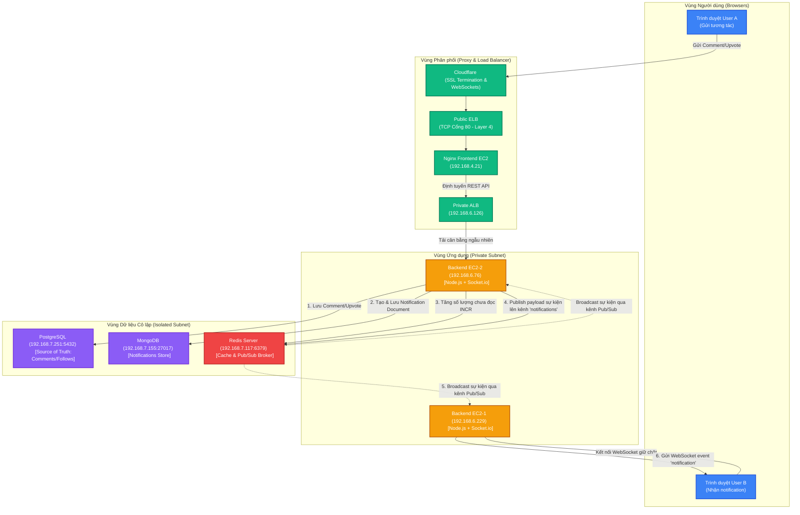
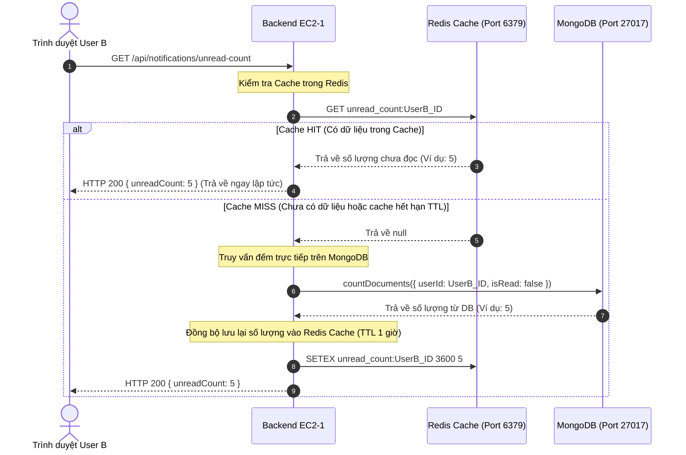

# Sơ đồ Luồng Hoạt động của Redis & Liên kết Cơ sở Dữ liệu

Tài liệu này chứa mã nguồn **Mermaid** mô tả kiến trúc đồng bộ thông báo thời gian thực bằng Redis Pub/Sub và lưu đệm dữ liệu (Caching) của dự án Clouddit trên cụm hạ tầng CMC Cloud.

---

## 1. Luồng đồng bộ Real-time qua Redis Pub/Sub & Liên kết Database

Sơ đồ dưới đây mô tả luồng đi của dữ liệu tương tác (ví dụ: bình luận, upvote) từ Trình duyệt người gửi, đi qua hệ thống Load Balancer phân tán, ghi vào các cơ sở dữ liệu (PostgreSQL, MongoDB) và đồng bộ qua Redis Pub/Sub để đẩy thông báo thời gian thực về Trình duyệt người nhận.

---

## 2. Luồng Cache Đếm số lượng thông báo chưa đọc (Unread Count Caching)

Sơ đồ tuần tự thể hiện cơ chế tiết kiệm tải cho MongoDB bằng cách lưu bộ đệm số lượng chưa đọc (Unread Count) vào Redis Cache với TTL (Time-To-Live) là 1 giờ.

---

## Hướng dẫn Render hình ảnh

Để xem trực quan sơ đồ trên:
1. Mở file này trong VS Code và nhấn nút **Markdown Preview** (`Ctrl + Shift + V` hoặc `Cmd + Shift + V` trên Mac).
2. Hoặc bạn có thể truy cập trang tài liệu [**`ARCHITECTURE_GUIDE.html`**](file:///Users/caolegiaphu/Documents/cmc/reddit-project/ARCHITECTURE_GUIDE.html), các sơ đồ này đã được nhúng trực tiếp và render tự động bằng thư viện **Mermaid.js**.
